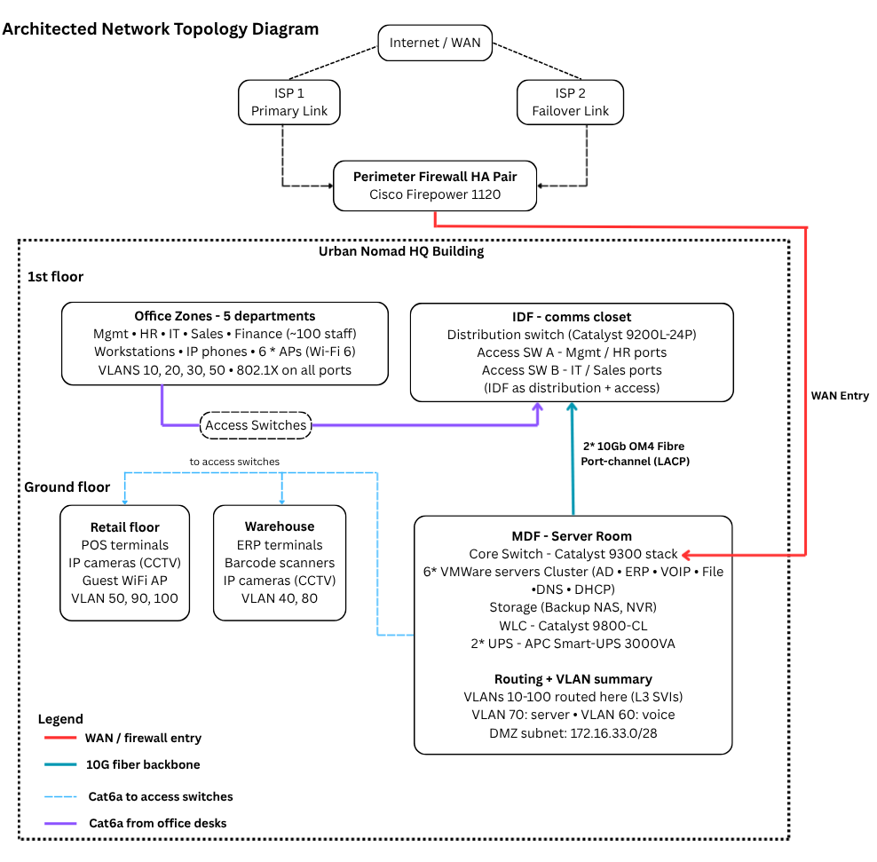
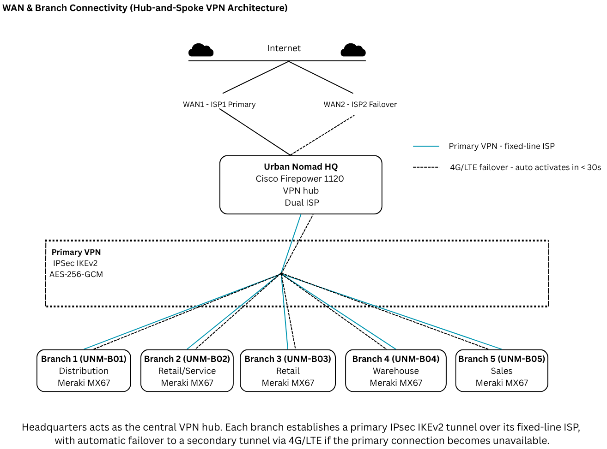
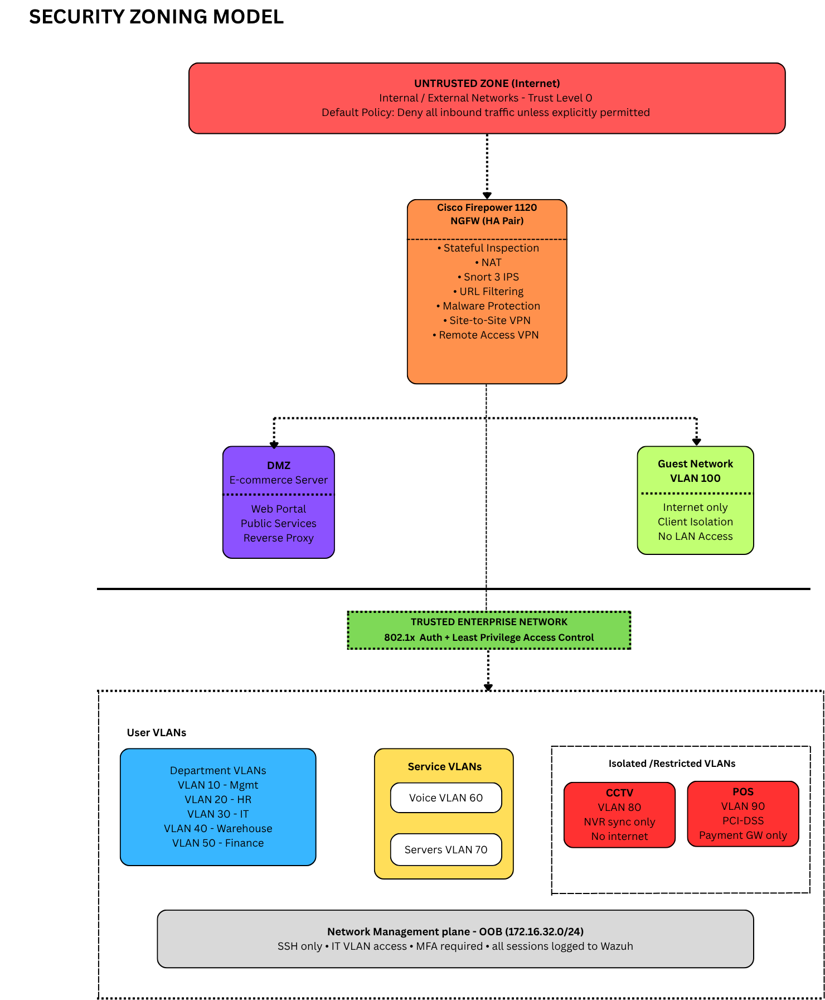

## Urban Nomad Motorcycle Gears - Enterprise Network Design Documentation (In Progress)

*A complete enterprise network design for a fictional retail & distribution company, demonstrating real-world enterprise networking concepts using Cisco technologies.*

---

## Project Overview
This project simulates the complete network infrastructure for Urban Nomad Motorcycle Gears, including:

🏢 Headquarters (80–120 users)
🌐 Five remote branch offices
🔒 Enterprise security architecture
📡 Dual ISP WAN with VPN redundancy
📶 Wireless network design
🖥️ Cisco Packet Tracer implementation

---

## Technologies

- Cisco Catalyst Switching
- Cisco Firepower NGFW
- Cisco Meraki
- Cisco ISE (802.1X)
- Cisco Packet Tracer
- Wazuh SIEM
- Active Directory
- IPsec IKEv2 VPN
---

## Project Highlights

- Three-tier enterprise campus design

- Dual ISP redundancy with automatic failover

- 11 VLANs with secure segmentation

- Zero Trust security architecture

- Site-to-site VPN for five branches

- Enterprise Wi-Fi design

- VoIP deployment

- DMZ for public services## Network Topology

---

## Architecture

##### WAN Topology (HQ ↔ 5 Branches)

##### Security Topology

---

## About

This project was designed and documented as a portfolio piece demonstrating enterprise network engineering skills across:

- **Network design** — IP addressing, VLANs, routing, switching
- **Security architecture** — Zero Trust, firewalling, NAC, SIEM
- **WAN design** — VPN, redundancy, branch connectivity
- **Cisco IOS** — hands-on configuration via Packet Tracer
- **Documentation** — professional technical writing across all phases

> *Built using free tools. Designed to enterprise standards.*

---

**Urban Nomad Motorcycle Gears - Enterprise Network Design Project**

